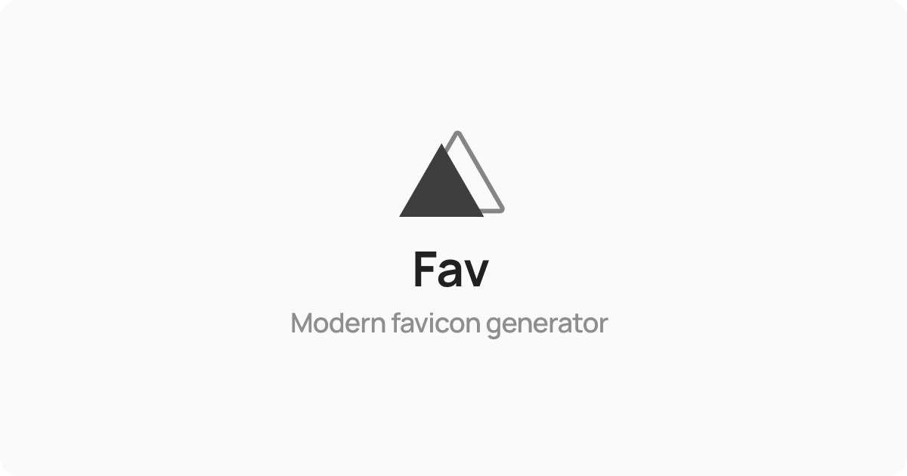

<h1 align="center">Fav</h1>

  

  
  

Fav is a next-generation favicons generator to generate a ready-to-use and compact favicon set for your modeern websites.

Fav doesn't store any kind of data, since all image processing are done directly on your browser.

Generate your favicons now with Fav by visiting [this link](https://fav.namchee.dev/).

> Note: You can install Fav by clicking the install button on the top right side of browser's address bar.
## References

This project is inspired by [How to Favicon in 2021:
Six files that fit most needs](https://evilmartians.com/chronicles/how-to-favicon-in-2021-six-files-that-fit-most-needs) by [Evil Martians](https://evilmartians.com/)

## License

This project is licensed under the [MIT license](./LICENSE)
